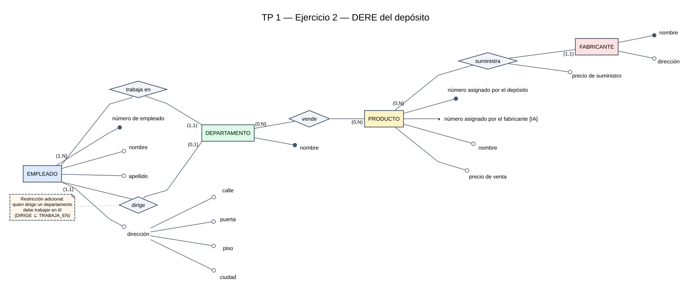

# Resolución TP 1

## Ejercicio 1

### Supuestos

- Un cliente puede registrarse antes de realizar una compra; por eso puede tener cero facturas.
- Toda factura válida contiene al menos un producto.
- Un producto puede existir en el catálogo aunque todavía no haya sido vendido.
- `direccion` se modela como atributo simple porque la consigna no pide registrar sus componentes.
- El teléfono principal es obligatorio y univaluado; el alternativo es opcional y univaluado; los celulares son opcionales y multivaluados.
- `precio` conserva el precio actual del producto y `precioVenta` conserva el precio aplicado en cada factura. Esto evita modificar la historia cuando cambia el precio actual.
- `importeTotal` es derivado: se obtiene sumando `cantidad × precioVenta` para todos los productos de la factura.

La consigna aconseja identificar primero entidades, luego relaciones y por último atributos, además de mantener el modelo simple. [P01, p. 1]

### Entidades, relaciones y atributos

| Elemento | Atributos | Observaciones |
|---|---|---|
| **Cliente** | `identificador`, `nombre`, `apellido`, `fechaNacimiento`, `direccion`, `telefonoPrincipal`, `telefonoAlternativo`, `telefonosCelulares` | `identificador` es el identificador principal; `telefonoAlternativo` es opcional; `telefonosCelulares` es opcional y multivaluado. |
| **Factura** | `tipo`, `numero`, `fecha`, `importeTotal` | El par (`tipo`, `numero`) es el identificador principal compuesto; `importeTotal` es derivado. |
| **Producto** | `codigo`, `nombre`, `precio` | `codigo` es el identificador principal; `precio` representa el precio actual. |
| **tiene** | — | Relación binaria entre Cliente y Factura. Evita copiar el nombre del cliente dentro de la factura. |
| **contiene** | `cantidad`, `precioVenta` | Relación binaria N:N entre Factura y Producto. Ambos atributos dependen de la combinación factura-producto. |

Los atributos pueden clasificarse por presencia, cantidad de valores, rol, composición y origen. Un identificador puede ser compuesto, pero no opcional ni multivaluado. [T02, pp. 14–19] Las relaciones pueden tener atributos propios, como `cantidad` y `precioVenta`. [T02, pp. 21, 23–24]

### Cardinalidades expresadas en lenguaje natural

- Un **Cliente** puede tener entre cero y muchas **Facturas**.
- Una **Factura** pertenece obligatoriamente a un único **Cliente**.
- Una **Factura** contiene entre uno y muchos **Productos**.
- Un **Producto** puede aparecer en entre cero y muchas **Facturas**.

La notación usada es *look-across*: para una instancia de una entidad se lee la cardinalidad escrita junto a la entidad de destino. [T02, pp. 26–27]

### Diagrama

Fuente editable: [`dere-ejercicio-01.dot`](dere-ejercicio-01.dot).

Leyenda:

- El círculo negro marca un identificador principal y el círculo vacío, un atributo descriptor.
- La línea continua indica un atributo obligatorio y la discontinua, uno opcional.
- La bifurcación antes del círculo indica un atributo multivaluado.
- El identificador compuesto de Factura se ramifica en `tipo` y `numero`.
- `importeTotal` se etiqueta expresamente como derivado; la fuente define ese origen, pero no le asigna en esas páginas un marcador gráfico específico.
- `precioVenta` está unido a `contiene`, no a Producto: cada venta conserva su propio precio aunque luego cambie `Producto.precio`. [P01, p. 1]

La representación de atributos sigue la convención visual de la cátedra: atributos colocados junto a la entidad o relación, presencia mediante el tipo de línea, cardinalidad mediante la bifurcación y rol mediante el relleno del círculo. [T02, pp. 9, 14–17, 19]

## Ejercicio 2

### Supuestos

- `Deposito` delimita el sistema, pero no se modela como entidad porque la consigna considera uno solo y no proporciona atributos para identificarlo o describirlo.
- Todo empleado trabaja en exactamente un departamento.
- Todo departamento tiene al menos un empleado y exactamente un jefe.
- Un empleado puede dirigir como máximo un departamento y, si lo dirige, debe trabajar en ese mismo departamento.
- Tanto departamentos como productos pueden existir antes de quedar asociados mediante `vende`; por eso esa relación es opcional en ambos sentidos.
- Cada producto tiene exactamente un fabricante; un fabricante puede estar registrado aunque todavía no suministre productos.
- Los dos números de Producto identifican unívocamente por separado. Se elige el número asignado por el depósito como identificador principal y el del fabricante como alternativo.
- `precioVenta` describe al producto dentro del depósito; `precioSuministro` describe la asociación entre fabricante y producto.
- La dirección de Empleado es compuesta porque la consigna enumera sus componentes. La dirección de Fabricante se conserva simple porque no se detallan componentes.

La exigencia de que el jefe trabaje en el mismo departamento es un supuesto añadido a esta resolución; no está expresada literalmente por la consigna. `Complemento del agente (no consta en el material cargado)`: se anota formalmente como `DIRIGE ⊆ TRABAJA_EN`.

### Entidades, relaciones y atributos

| Elemento | Atributos | Observaciones |
|---|---|---|
| **Empleado** | `numeroEmpleado`, `nombre`, `apellido`, `direccion {calle, puerta, piso, ciudad}` | `numeroEmpleado` es el identificador principal; `direccion` es compuesta. |
| **Departamento** | `nombre` | `nombre` es el identificador principal. |
| **Producto** | `numeroDeposito`, `numeroFabricante`, `nombre`, `precioVenta` | `numeroDeposito` es el identificador principal y `numeroFabricante`, el alternativo. |
| **Fabricante** | `nombre`, `direccion` | `nombre` es el identificador principal; `direccion` se modela simple. |
| **trabaja en** | — | Relación 1:N entre Departamento y Empleado. |
| **dirige** | — | Relación 1:1 entre Empleado y Departamento, obligatoria para Departamento y opcional para Empleado. |
| **vende** | — | Relación N:N entre Departamento y Producto. |
| **suministra** | `precioSuministro` | Relación 1:N entre Fabricante y Producto. |

Los atributos pueden clasificarse por presencia, cardinalidad, rol, composición y origen. La dirección de Empleado aplica el patrón de atributo compuesto, mientras que Producto posee un identificador principal y otro alternativo. [T02, pp. 14–19] El precio de suministro se coloca en la relación porque describe la asociación entre Fabricante y Producto; las relaciones pueden tener atributos propios. [T02, pp. 21, 23–24]

### Cardinalidades expresadas en lenguaje natural

- Cada **Empleado** trabaja obligatoriamente en un único **Departamento**.
- Cada **Departamento** tiene entre uno y muchos **Empleados**.
- Cada **Departamento** es dirigido obligatoriamente por un único **Empleado**.
- Cada **Empleado** puede dirigir entre cero y un **Departamento**.
- Cada **Departamento** puede vender entre cero y muchos **Productos**.
- Cada **Producto** puede ser vendido por entre cero y muchos **Departamentos**.
- Cada **Producto** es suministrado obligatoriamente por un único **Fabricante**.
- Cada **Fabricante** puede suministrar entre cero y muchos **Productos**.

Las cardinalidades se escriben con lectura *look-across*, sobre la línea del lado de la entidad destino. [T02, pp. 26–27] Los datos de las cuatro entidades y las relaciones requeridas provienen de la consigna oficial. [P01, p. 2]

### Diagrama

Fuente editable: [`dere-ejercicio-02.dot`](dere-ejercicio-02.dot).

Leyenda:

- El círculo negro marca el identificador principal, el medio círculo (`◐`) el identificador alternativo y el círculo vacío un descriptor.
- Las líneas continuas indican atributos obligatorios.
- La ramificación de `direccion` muestra sus componentes.
- La nota junto a `dirige` documenta la restricción adicional acordada para esta resolución.
- La representación de atributos y relaciones sigue la convención gráfica presentada por la cátedra. [T02, pp. 9, 14–19, 26]

## Ejercicio 3

### Supuestos

### Entidades, relaciones y atributos

### Cardinalidades expresadas en lenguaje natural

### Diagrama
