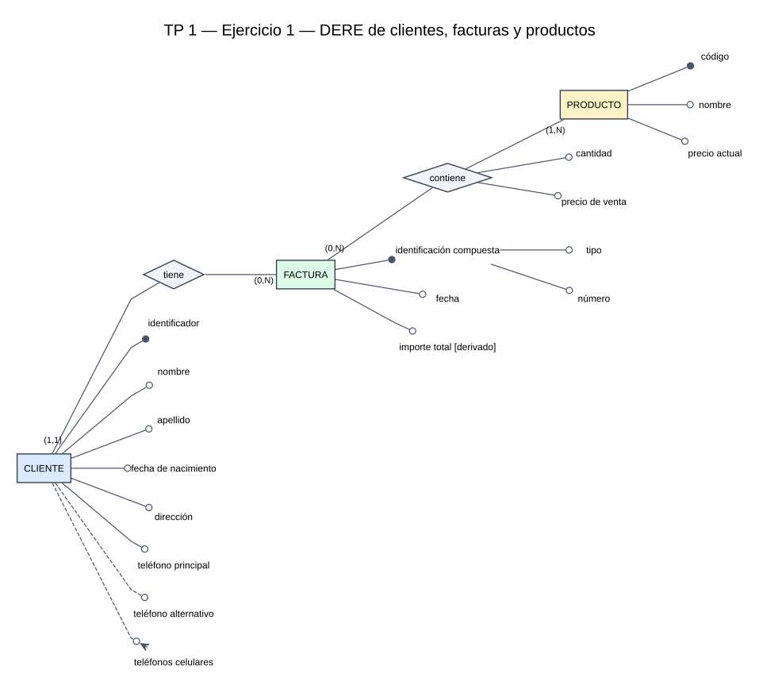

# Resolución TP 1

## Ejercicio 1

### Supuestos

- Un cliente puede registrarse antes de realizar una compra; por eso puede tener cero facturas.
- Toda factura válida contiene al menos un producto.
- Un producto puede existir en el catálogo aunque todavía no haya sido vendido.
- `direccion` se modela como atributo simple porque la consigna no pide registrar sus componentes.
- El teléfono principal es obligatorio y univaluado; el alternativo es opcional y univaluado; los celulares son opcionales y multivaluados.
- `precio` conserva el precio actual del producto y `precioVenta` conserva el precio aplicado en cada factura. Esto evita modificar la historia cuando cambia el precio actual.
- `importeTotal` es derivado: se obtiene sumando `cantidad × precioVenta` para todos los productos de la factura.

La consigna aconseja identificar primero entidades, luego relaciones y por último atributos, además de mantener el modelo simple. [P01, p. 1]

### Entidades, relaciones y atributos

| Elemento | Atributos | Observaciones |
|---|---|---|
| **Cliente** | `identificador`, `nombre`, `apellido`, `fechaNacimiento`, `direccion`, `telefonoPrincipal`, `telefonoAlternativo`, `telefonosCelulares` | `identificador` es el identificador principal; `telefonoAlternativo` es opcional; `telefonosCelulares` es opcional y multivaluado. |
| **Factura** | `tipo`, `numero`, `fecha`, `importeTotal` | El par (`tipo`, `numero`) es el identificador principal compuesto; `importeTotal` es derivado. |
| **Producto** | `codigo`, `nombre`, `precio` | `codigo` es el identificador principal; `precio` representa el precio actual. |
| **tiene** | — | Relación binaria entre Cliente y Factura. Evita copiar el nombre del cliente dentro de la factura. |
| **contiene** | `cantidad`, `precioVenta` | Relación binaria N:N entre Factura y Producto. Ambos atributos dependen de la combinación factura-producto. |

Los atributos pueden clasificarse por presencia, cantidad de valores, rol, composición y origen. Un identificador puede ser compuesto, pero no opcional ni multivaluado. [T02, pp. 14–19] Las relaciones pueden tener atributos propios, como `cantidad` y `precioVenta`. [T02, pp. 21, 23–24]

### Cardinalidades expresadas en lenguaje natural

- Un **Cliente** puede tener entre cero y muchas **Facturas**.
- Una **Factura** pertenece obligatoriamente a un único **Cliente**.
- Una **Factura** contiene entre uno y muchos **Productos**.
- Un **Producto** puede aparecer en entre cero y muchas **Facturas**.

La notación usada es *look-across*: para una instancia de una entidad se lee la cardinalidad escrita junto a la entidad de destino. [T02, pp. 26–27]

### Diagrama

Fuente editable: [`dere-ejercicio-01.dot`](dere-ejercicio-01.dot).

Leyenda:

- El círculo negro marca un identificador principal y el círculo vacío, un atributo descriptor.
- La línea continua indica un atributo obligatorio y la discontinua, uno opcional.
- La bifurcación antes del círculo indica un atributo multivaluado.
- El identificador compuesto de Factura se ramifica en `tipo` y `numero`.
- `importeTotal` se etiqueta expresamente como derivado; la fuente define ese origen, pero no le asigna en esas páginas un marcador gráfico específico.
- `precioVenta` está unido a `contiene`, no a Producto: cada venta conserva su propio precio aunque luego cambie `Producto.precio`. [P01, p. 1]

La representación de atributos sigue la convención visual de la cátedra: atributos colocados junto a la entidad o relación, presencia mediante el tipo de línea, cardinalidad mediante la bifurcación y rol mediante el relleno del círculo. [T02, pp. 9, 14–17, 19]

## Ejercicio 2

### Supuestos

### Entidades, relaciones y atributos

### Cardinalidades expresadas en lenguaje natural

### Diagrama

## Ejercicio 3

### Supuestos

### Entidades, relaciones y atributos

### Cardinalidades expresadas en lenguaje natural

### Diagrama
